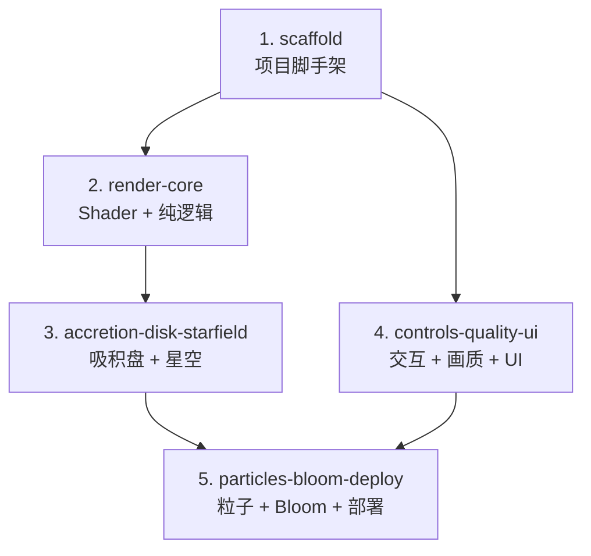

# DAG — interstellar-blackhole

## 并行度

| 任务 | 最大并行数 | 前提 |
|------|----------|------|
| T1 | 1 | — |
| T2+T4 | 2 | T1 完成 |
| T3 | 1 | T2 完成 |
| T5 | 1 | T3+T4 完成 |

## 验证策略

| 任务 | 独立验证手段 |
|------|------------|
| scaffold | `npm run dev` → 空白 Canvas |
| render-core | `npm test -- run`（纯逻辑单测全部通过）、页面渲染出黑洞剪影（事件视界 + 光子环） |
| accretion-disk-starfield | 页面显示吸积盘双像 + 温度梯度 + 星空透镜扭曲 |
| controls-quality-ui | OrbitControls 拖拽生效、画质档位正确检测、UI 叠加层可见 |
| particles-bloom-deploy | 粒子流可见、Bloom 辉光可见、`npm run build` 成功 |
